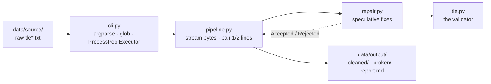

# tlekit Conventions Alignment Implementation Plan

> **For agentic workers:** REQUIRED SUB-SKILL: Use superpowers:subagent-driven-development (recommended) or superpowers:executing-plans to implement this plan task-by-task. Steps use checkbox (`- [ ]`) syntax for tracking.

**Goal:** Bring the implemented `tlekit` project up to the tooling, code-quality, test-structure, and documentation conventions of the reference project `descent-engine`, without changing any runtime behaviour.

**Architecture:** Eight ordered tasks. Task 1 adds tooling (`ruff`, `pytest-cov`) and project-setup files. Task 2 reorganises the seven test files into `Test*` classes. Task 3 runs the `ruff` format + lint pass. Tasks 4–7 add the four project documents. Task 8 audits docstrings and runs final verification. The guardrail throughout: **77 tests must keep passing** — that is the proof each non-additive change was behaviour-neutral.

**Tech Stack:** Python 3.11 · uv · pytest · pytest-cov · ruff · standard library only at runtime.

**Authoritative spec:** `docs/superpowers/specs/2026-05-22-conventions-alignment-design.md`

**Branch:** all work happens on `chore/conventions-alignment` (already created and checked out).

---

## Execution outcome (2026-05-22)

This plan was partially superseded by concurrent development on the same branch. Recording
what actually happened so the plan stays an honest record:

- **Tasks 1, 3, 4 — already done before execution.** Commit `b1414aa` added the `ruff` +
  `pytest-cov` tooling, the `[tool.ruff]` config, `.python-version`, and `tests/__init__.py`;
  commit `de40e80` added `README.md`. Both predate this plan. The existing `README.md` was
  kept as-is rather than replaced with the version drafted in Task 4.
- **Task 2 — done** (commit `a5b9fd6`). All seven test files reorganised into `Test*`
  classes. The suite had grown to 78 tests after concurrent feature work (`a60c633` added a
  live progress display and `cli._format_elapsed`); the reorganisation folded that in.
- **Tasks 5, 6, 7 — done.** `CONTRIBUTING.md`, `CHANGELOG.md`, and the refreshed
  `CLAUDE.md` reflect the current code, including the live-progress / Ctrl-C functionality.
- **Task 8 — done.** 78 tests pass; `ruff check` and `ruff format --check` clean; coverage
  92%. The docstring audit flagged only `pct`, a one-line nested closure inside
  `report.format_run_report` — not a public symbol, so intentionally left undocumented.

The task descriptions below are the plan as originally written; the outcome above is what
was executed.

---

## Task 1: Build & tooling setup

Add `ruff` and `pytest-cov`, the `[tool.ruff]` config, and two project-setup files.

**Files:**
- Modify: `pyproject.toml`
- Create: `.python-version`
- Create: `tests/__init__.py`
- Regenerated: `uv.lock` (by `uv sync`)

- [ ] **Step 1: Replace the entire contents of `pyproject.toml` with the following**

The tables are reordered to match `descent-engine`'s layout (`build-system`, `project`, `project.scripts`, `dependency-groups`, then `tool.*`). `[tool.hatch.build.targets.wheel]` is kept — `tlekit` needs it because the package directory name does not equal the distribution name.

```toml
[build-system]
requires = ["hatchling"]
build-backend = "hatchling.build"

[project]
name = "tlekit"
version = "0.1.0"
description = "Validator and cleaner for Two-Line Element (TLE) corpus files"
requires-python = ">=3.11"
dependencies = []

[project.scripts]
tle-clean = "tlekit.cli:main"

[dependency-groups]
dev = [
    "pytest>=8.0",
    "pytest-cov",
    "ruff",
    "sgp4>=2.23",
]

[tool.hatch.build.targets.wheel]
packages = ["src/tlekit"]

[tool.ruff]
target-version = "py311"
line-length = 88
src = ["src"]

[tool.ruff.lint]
select = ["E", "F", "I", "UP", "B", "SIM"]

[tool.pytest.ini_options]
testpaths = ["tests"]
```

- [ ] **Step 2: Create `.python-version` with this exact content (one line, no trailing blank line)**

```
3.11
```

- [ ] **Step 3: Create an empty `tests/__init__.py`**

The file has zero bytes — it only marks `tests/` as a package, matching `descent-engine`. Create it empty:

```bash
: > tests/__init__.py
```

- [ ] **Step 4: Install the new dependencies**

Run: `uv sync`
Expected: completes without error; installs `ruff` and `pytest-cov`; updates `uv.lock`.

- [ ] **Step 5: Verify ruff is now available**

Run: `uv run ruff --version`
Expected: prints a version like `ruff 0.x.y` (no "command not found").

- [ ] **Step 6: Verify the test suite still collects and passes**

Run: `uv run pytest -q`
Expected: `77 passed`. (Adding `tests/__init__.py` changes nothing about discovery — this confirms it.)

- [ ] **Step 7: Commit**

```bash
git add pyproject.toml .python-version tests/__init__.py uv.lock
git commit -m "chore: add ruff and pytest-cov tooling, pin python version"
```

---

## Task 2: Reorganise test files into `Test*` classes

Convert flat module-level test functions in all seven test files into methods of `Test*` classes, one class per unit or behaviour under test — matching `descent-engine`'s style.

**Files:**
- Modify: `tests/test_tle.py`
- Modify: `tests/test_repair.py`
- Modify: `tests/test_pipeline.py`
- Modify: `tests/test_report.py`
- Modify: `tests/test_cli.py`
- Modify: `tests/test_integration.py`
- Modify: `tests/test_oracle.py`

### The transformation recipe (applies to every file)

For each file:

1. **Module docstring** — if the file has no module docstring, add the one given below as the file's first line. If it already has one (`test_integration.py`, `test_oracle.py`), keep it unchanged.
2. **Module-level constants and helper functions stay at module level** — e.g. `_stats_with_counts` and `_two_file_stats` in `test_report.py`. They are NOT moved into classes. Place them after the imports, before the first class.
3. **Each test function becomes a method** of the class it is assigned to below:
   - Add `self` as the first parameter: `def test_x(tmp_path):` → `def test_x(self, tmp_path):`. A test with no parameters becomes `def test_x(self):`.
   - Indent the entire function body by four more spaces.
   - **Do not change the body, the assertions, the test name, or any comment.**
   - `pytest` fixtures (`line1`, `line2`, `tmp_path`, `capsys`, `monkeypatch`) remain ordinary parameters after `self`.
4. **Do not hand-wrap long lines.** Indenting bodies by four spaces may push some lines past 88 columns. Leave them — Task 3's `ruff format` rewraps them. Task 2's only guardrail is that tests still pass.
5. Classes need no docstring and no base class: `class TestX:` then the methods.

### Class assignments per file

**`tests/test_tle.py`** — add module docstring: `"""Tests for tlekit.tle — the TLE validator."""`

| Class | Methods (in this order) |
|-------|-------------------------|
| `TestComputeChecksum` | `test_checksum_of_canonical_line1`, `test_checksum_of_canonical_line2`, `test_minus_sign_counts_as_one`, `test_non_digit_non_minus_counts_as_zero` |
| `TestCheckColumns` | `test_valid_line1_passes_column_checks`, `test_valid_line2_passes_column_checks`, `test_wrong_body_length_reported`, `test_bad_line_number_prefix`, `test_missing_separator_space`, `test_letter_in_digit_only_field_rejected` |
| `TestValidateBody` | `test_validate_body_accepts_canonical`, `test_inclination_out_of_range_rejected`, `test_mean_motion_must_be_positive`, `test_column_failure_short_circuits_semantics` |
| `TestChecksumError` | `test_checksum_error_returns_none_when_valid`, `test_checksum_error_non_digit` |
| `TestValidateLine` | `test_validate_line_accepts_canonical`, `test_validate_line_rejects_wrong_length`, `test_checksum_mismatch_detected` |
| `TestValidateRecord` | `test_validate_record_accepts_canonical`, `test_validate_record_detects_catalog_mismatch` |

**`tests/test_repair.py`** — add module docstring: `"""Tests for tlekit.repair — speculative, validated line and record repair."""`

| Class | Methods (in this order) |
|-------|-------------------------|
| `TestRepairLine` | `test_strip_trailing_backslash`, `test_reconstruct_missing_checksum`, `test_reconstruct_with_backslash_artifact`, `test_crlf_normalised`, `test_checksum_mismatch_rejected`, `test_non_ascii_byte_rejected`, `test_interior_character_missing_rejected`, `test_wrong_length_rejected`, `test_leading_whitespace_trimmed`, `test_trailing_whitespace_trimmed`, `test_invalid_columns_rejected` |
| `TestProcessRecord` | `test_process_accepts_clean_record`, `test_process_repairs_backslash_and_checksum`, `test_process_rejects_bad_line`, `test_process_rejects_catalog_mismatch`, `test_process_rejects_both_bad_lines` |

**`tests/test_pipeline.py`** — add module docstring: `"""Tests for tlekit.pipeline — streaming I/O, line pairing, file processing."""`

| Class | Methods (in this order) |
|-------|-------------------------|
| `TestIterRecords` | `test_pairs_simple_records`, `test_blank_and_cr_only_lines_dropped`, `test_whitespace_only_line_dropped`, `test_lone_line1_at_eof_is_orphaned`, `test_two_line1s_orphan_the_first`, `test_orphan_line2`, `test_bad_prefix_line` |
| `TestProcessFile` | `test_process_file_clean_mode`, `test_process_file_quarantines_bad_record`, `test_validate_mode_writes_nothing`, `test_internal_error_is_quarantined_not_raised`, `test_clean_run_leaves_no_temp_file`, `test_failed_run_does_not_leak_temp_file`, `test_process_file_emits_progress`, `test_progress_disabled_when_every_is_zero` |

**`tests/test_cli.py`** — add module docstring: `"""Tests for tlekit.cli — argument parsing, path discovery, exit codes."""`

| Class | Methods (in this order) |
|-------|-------------------------|
| `TestDiscoverPaths` | `test_discover_expands_directory`, `test_discover_passes_through_explicit_files` |
| `TestBuildParser` | `test_parser_defaults`, `test_parser_accepts_jobs_and_paths` |
| `TestMain` | `test_main_clean_returns_zero_on_clean_corpus`, `test_main_returns_one_when_records_quarantined`, `test_main_returns_two_when_no_input_files`, `test_main_validate_prints_summary`, `test_main_returns_two_when_a_file_fails_to_process`, `test_main_returns_two_on_disk_shortfall`, `test_main_prints_progress_to_stderr` |

**`tests/test_integration.py`** — keep its existing module docstring.

| Class | Methods (in this order) |
|-------|-------------------------|
| `TestEndToEnd` | `test_golden_mixed_file`, `test_clean_is_idempotent`, `test_cleaned_output_revalidates_as_perfect`, `test_every_cleaned_line_passes_validate_line` |

**`tests/test_oracle.py`** — keep its existing module docstring.

| Class | Methods (in this order) |
|-------|-------------------------|
| `TestOracle` | `test_canonical_tle_accepted_by_both` |

### Worked example: `tests/test_report.py`

`test_report.py` is the only file with module-level helper functions, so it is shown in full. The helpers `_stats_with_counts` and `_two_file_stats` stay at module level; the nine tests are grouped into four classes. After this transformation `tests/test_report.py` reads exactly:

````python
"""Tests for tlekit.report — statistics, the quarantine sidecar, and summaries."""

import json

from tlekit import report


def _stats_with_counts():
    stats = report.FileStats(src_name="tle2022.txt")
    stats.total_records = 100
    stats.clean_count = 98
    stats.quarantined_count = 2
    stats.fix_counts = {"trailing-backslash": 50, "reconstructed-checksum": 7}
    stats.reject_categories = {"checksum-mismatch": 2}
    return stats


def _two_file_stats():
    a = report.FileStats(src_name="tle2004.txt")
    a.total_records = 1000
    a.clean_count = 990
    a.quarantined_count = 10
    a.fix_counts = {"trailing-backslash": 990}
    a.reject_categories = {"checksum-mismatch": 10}
    b = report.FileStats(src_name="tle2005.txt")
    b.total_records = 3000
    b.clean_count = 3000
    b.quarantined_count = 0
    b.fix_counts = {"trailing-backslash": 1000, "reconstructed-checksum": 500}
    return [a, b]


class TestWriteBrokenFile:
    def test_write_broken_file(self, tmp_path):
        stats = report.FileStats(src_name="tle2099.txt")
        stats.total_records = 5
        stats.quarantined_count = 1
        stats.rejects.append(
            report.RejectEntry(
                raw_lines=[b"1 garbage"],
                source_lines=[42],
                reason="bad-prefix: line does not start with '1 ' or '2 '",
            )
        )
        out = tmp_path / "tle2099.broken.txt"

        report.write_broken_file(str(out), "tle2099.txt", stats)

        text = out.read_bytes()
        assert b"# source: tle2099.txt" in text
        assert b"1 records quarantined of 5 total" in text
        assert b"source line 42" in text
        assert b"1 garbage" in text

    def test_broken_file_is_byte_faithful(self, tmp_path):
        # A line quarantined for a non-ASCII byte must appear verbatim.
        stats = report.FileStats(src_name="x.txt")
        stats.quarantined_count = 1
        stats.rejects.append(
            report.RejectEntry(
                raw_lines=[b"1 \xff\xfe non-ascii"], source_lines=[7], reason="non-ascii"
            )
        )
        out = tmp_path / "x.broken.txt"

        report.write_broken_file(str(out), "x.txt", stats)

        assert b"\xff\xfe" in out.read_bytes()

    def test_two_line_record_location(self, tmp_path):
        stats = report.FileStats(src_name="x.txt")
        stats.quarantined_count = 1
        stats.rejects.append(
            report.RejectEntry(
                raw_lines=[b"1 aaa", b"2 bbb"],
                source_lines=[14820, 14821],
                reason="line 2: checksum mismatch",
            )
        )
        out = tmp_path / "x.broken.txt"

        report.write_broken_file(str(out), "x.txt", stats)

        assert b"source lines 14820-14821" in out.read_bytes()


class TestSummaries:
    def test_format_summary_shows_counts(self):
        out = report.format_summary(_stats_with_counts())
        assert "tle2022.txt" in out
        assert "100" in out  # total_records — the anchor field of the header
        assert "98" in out
        assert "trailing-backslash 50" in out
        assert "reconstructed-checksum 7" in out
        assert "checksum-mismatch 2" in out

    def test_summary_dict_is_json_friendly(self):
        data = report.summary_dict(_stats_with_counts())
        assert data["src_name"] == "tle2022.txt"
        assert data["total_records"] == 100
        assert data["fix_counts"]["trailing-backslash"] == 50
        assert data["reject_categories"]["checksum-mismatch"] == 2
        json.dumps(data)  # must not raise — cli.py serialises this in json mode


class TestFormatRejectLines:
    def test_format_reject_lines_lists_locations(self):
        stats = report.FileStats(src_name="x.txt")
        stats.rejects.append(
            report.RejectEntry(
                raw_lines=[b"1 a", b"2 b"],
                source_lines=[10, 11],
                reason="line 2: checksum mismatch",
            )
        )
        out = report.format_reject_lines(stats)
        assert "10-11" in out and "checksum mismatch" in out

    def test_format_reject_lines_caps_long_lists(self):
        stats = report.FileStats(src_name="x.txt")
        for i in range(250):
            stats.rejects.append(
                report.RejectEntry(
                    raw_lines=[b"1 a"], source_lines=[i], reason="bad-prefix"
                )
            )
        out = report.format_reject_lines(stats, limit=100)
        assert "150 more" in out


class TestRunReport:
    def test_format_run_report_aggregates_corpus(self):
        out = report.format_run_report(_two_file_stats())
        assert "# tlekit clean run report" in out
        assert "Files processed: 2" in out
        assert "Records: 4,000" in out  # 1000 + 3000
        assert "Cleaned: 3,990" in out  # 990 + 3000
        assert "Quarantined: 10" in out
        assert "99.7500%" in out  # 3990 / 4000
        assert "trailing-backslash | 1,990" in out  # 990 + 1000, summed
        assert "reconstructed-checksum | 500" in out
        assert "checksum-mismatch | 10" in out
        # Per-file rows present.
        assert "tle2004.txt" in out and "tle2005.txt" in out

    def test_write_run_report(self, tmp_path):
        out = tmp_path / "report.md"
        report.write_run_report(str(out), _two_file_stats())
        text = out.read_text(encoding="utf-8")
        assert text.startswith("# tlekit clean run report")
        assert "Per-file breakdown" in text
````

### Steps

- [ ] **Step 1: Reorganise `tests/test_tle.py`** per the recipe and its class table. Run: `uv run pytest tests/test_tle.py -q` — Expected: `21 passed`.

- [ ] **Step 2: Reorganise `tests/test_repair.py`** per the recipe and its class table. Run: `uv run pytest tests/test_repair.py -q` — Expected: `16 passed`.

- [ ] **Step 3: Reorganise `tests/test_pipeline.py`** per the recipe and its class table. Run: `uv run pytest tests/test_pipeline.py -q` — Expected: `15 passed`.

- [ ] **Step 4: Reorganise `tests/test_report.py`** to exactly the worked-example content above. Run: `uv run pytest tests/test_report.py -q` — Expected: `9 passed`.

- [ ] **Step 5: Reorganise `tests/test_cli.py`** per the recipe and its class table. Run: `uv run pytest tests/test_cli.py -q` — Expected: `11 passed`.

- [ ] **Step 6: Reorganise `tests/test_integration.py`** per the recipe and its class table (keep the existing module docstring). Run: `uv run pytest tests/test_integration.py -q` — Expected: `4 passed`.

- [ ] **Step 7: Reorganise `tests/test_oracle.py`** per the recipe and its class table (keep the existing module docstring). Run: `uv run pytest tests/test_oracle.py -q` — Expected: `1 passed`.

- [ ] **Step 8: Verify the whole suite**

Run: `uv run pytest -q`
Expected: `77 passed`.

- [ ] **Step 9: Commit**

```bash
git add tests/
git commit -m "test: group tests into Test* classes"
```

---

## Task 3: Ruff code-quality pass

Apply `ruff format` and fix every `ruff check` finding across source and tests.

**Files:** potentially every file under `src/tlekit/` and `tests/` (formatter-driven).

- [ ] **Step 1: Apply the formatter**

Run: `uv run ruff format .`
Expected: prints `N files reformatted` / `M files left unchanged`. The reformatting is whitespace and line-wrapping only — chiefly rewrapping the test methods that Task 2 pushed past 88 columns.

- [ ] **Step 2: Auto-fix the mechanical lint findings**

Run: `uv run ruff check . --fix`
Expected: any import-ordering (`I`) and other auto-fixable findings are resolved.

- [ ] **Step 3: Inspect the remaining findings**

Run: `uv run ruff check .`
Expected: ideally `All checks passed!`. `src/tlekit/pipeline.py` already carries a deliberate `# noqa: SIM115` for its long-lived file handle — leave it.

If any finding remains:
- If the fix is a clear improvement that does not change behaviour, apply it.
- If the "fix" would obscure intent (as the `SIM115` case would), add a scoped `# noqa: <rule>` with a short comment explaining why, matching the existing `pipeline.py` precedent.
- Do not change runtime behaviour to satisfy a lint rule.

- [ ] **Step 4: Verify formatting is now stable**

Run: `uv run ruff format --check .`
Expected: `N files already formatted` (no files would be reformatted).

- [ ] **Step 5: Verify the test suite still passes**

Run: `uv run pytest -q`
Expected: `77 passed`.

- [ ] **Step 6: Commit**

```bash
git add -A
git commit -m "style: apply ruff format and lint fixes"
```

---

## Task 4: Write `README.md`

**Files:**
- Create: `README.md`

- [ ] **Step 1: Create `README.md` with exactly this content**

````markdown
# tlekit

Validator and cleaner for a multi-gigabyte corpus of Two-Line Element (TLE)
satellite-tracking files exported from [space-track.org](https://www.space-track.org/).
The console script `tle-clean` audits the corpus for systematic export-pipeline defects
and emits a corrected copy of each file, quarantining any record it cannot *safely* fix.

## Quick Start

```bash
git clone <repo-url>
cd TLEs
uv sync
uv run tle-clean validate          # read-only audit of data/source/
uv run tle-clean clean             # write cleaned files to data/output/
```

## Commands

```bash
uv run tle-clean validate          # Audit files, report defects (writes nothing)
uv run tle-clean clean             # Write cleaned files + quarantine sidecars
uv run pytest                      # Run tests
uv run pytest --cov=tlekit --cov-report=term-missing --cov-branch  # Tests + coverage
uv run ruff check .                # Lint
uv run ruff format --check .       # Format check
```

## What it does

`tle-clean` has two modes:

- **`validate`** — a read-only audit. Reports defects by type and source location;
  writes nothing.
- **`clean`** — for every input file, writes `data/output/cleaned/<name>.cleaned.txt`,
  a `data/output/broken/<name>.broken.txt` quarantine sidecar, and a single
  `data/output/report.md` run summary.

Every fix is *validated*: a candidate repair is applied, full validation is re-run, and
the result is committed only if it now passes — otherwise the record is quarantined. The
tool never emits a wrong-but-valid-looking record.

### Defect distribution (measured over the full corpus)

| Defect | Share | Handling |
|--------|------:|----------|
| Trailing `\` export artifact on a line | ~67% | Stripped, then re-validated |
| Missing column-69 checksum digit | ~15% | Recomputed deterministically — a distinct, weaker repair tier |
| Already clean | ~17% | Passed through unchanged |
| Genuinely corrupt | <0.01% | Quarantined |

## Architecture

Module dependencies point one way only:

```
cli.py → pipeline.py → repair.py → tle.py
```



### Components

```
src/tlekit/
├── __main__.py    # python -m tlekit entry point
├── __init__.py    # __version__, stem() filename helper
├── cli.py         # argparse; path globbing; per-file ProcessPoolExecutor parallelism
├── pipeline.py    # streams a file in binary, pairs 1/2 lines into records, routes them
├── repair.py      # speculative fixes, each confirmed by tle.py before commit
├── report.py      # FileStats, the .broken.txt sidecar writer, the run report
└── tle.py         # the validator — column layout, checksum, semantic ranges, pairing
```

`tle.py` is the single source of truth for what a "perfect" TLE record is. Both
`validate` and `clean` reuse that one definition — there is no second validation path.

## Principles

These constraints are the reason the design exists:

1. **Validated transformation.** Never apply a fix and trust it. Apply it, re-run *full*
   validation, and commit only if it now passes — otherwise quarantine.
2. **Correctness over recovery.** Never emit a wrong-but-valid-looking record. No
   reconstruction of missing *data* characters; the one sanctioned reconstruction is a
   missing *checksum* digit, which is deterministically recomputable.
3. **Constant memory.** Files stream; the pairing state machine holds at most two lines.
   The largest corpus file (3.2 GB) is never loaded whole.
4. **One validator definition.** "Perfect" is defined once, in `tle.py`.

## Tech Stack

Python 3.11 · uv · standard library only at runtime · `sgp4` (test oracle, dev-only) ·
`pytest` · `pytest-cov` · `ruff`

## Documentation

- [Design spec](docs/superpowers/specs/2026-05-21-tle-corpus-cleaner-design.md) — the authoritative specification
- [CONTRIBUTING.md](CONTRIBUTING.md) — setup, testing, linting, and the git workflow
- [CHANGELOG.md](CHANGELOG.md) — release history
````

- [ ] **Step 2: Commit**

```bash
git add README.md
git commit -m "docs: add README"
```

---

## Task 5: Write `CONTRIBUTING.md`

**Files:**
- Create: `CONTRIBUTING.md`

- [ ] **Step 1: Create `CONTRIBUTING.md` with exactly this content**

````markdown
# Contributing to tlekit

## Prerequisites

- **Python 3.11+**
- **[uv](https://docs.astral.sh/uv/)** — Python package and project manager

## Setup

```bash
git clone <repo-url>
cd TLEs
uv sync
```

`uv sync` installs Python 3.11 if needed, creates a `.venv/`, and installs the project
plus all dev dependencies (`pytest`, `pytest-cov`, `sgp4`, `ruff`) from `uv.lock`.

### Managing dependencies

Dependencies are declared in `pyproject.toml` and pinned in `uv.lock` (committed to git).

```bash
uv add --group dev <pkg>   # Add a dev-only dependency
uv sync                    # Reinstall from the lock file (after a pull)
```

The **runtime has no third-party dependencies** — `tlekit` is pure standard library.
`sgp4` is a dev-only test oracle and must never be imported at runtime.

## Running

```bash
uv run tle-clean validate          # Read-only audit of data/source/
uv run tle-clean clean             # Write cleaned output to data/output/
```

`uv run` executes a command inside the project virtual environment — no manual
activation needed.

## Testing

```bash
uv run pytest                      # Run all tests
uv run pytest -x                   # Stop on first failure
uv run pytest -k "checksum"        # Run tests matching an expression
uv run pytest tests/test_tle.py    # Run one file
```

### Coverage

```bash
uv run pytest --cov=tlekit --cov-report=term-missing --cov-branch
```

This reports line and branch coverage, listing uncovered lines in the `Missing` column.

### Test layout

Tests are grouped into `Test*` classes, one per unit or behaviour under test.

| File | What it covers |
|------|----------------|
| `test_tle.py` | The validator: checksum, column layout, semantic ranges, record pairing |
| `test_repair.py` | Speculative line/record repair and the rejection categories |
| `test_pipeline.py` | Streaming I/O, line pairing, per-file processing, temp-file safety |
| `test_report.py` | `FileStats`, the `.broken.txt` sidecar, summaries, the run report |
| `test_cli.py` | Argument parsing, path discovery, exit codes |
| `test_integration.py` | End-to-end: golden output, idempotence, re-validation |
| `test_oracle.py` | Cross-checks a known-good TLE against the trusted `sgp4` parser |

`conftest.py` holds the shared `line1` / `line2` fixtures — a canonical, known-good TLE.

## Linting & Formatting

[Ruff](https://docs.astral.sh/ruff/) handles both linting and formatting. Its
configuration lives in `pyproject.toml` under `[tool.ruff]`.

```bash
uv run ruff check .                # Lint
uv run ruff check . --fix          # Lint with auto-fix
uv run ruff format .               # Format
uv run ruff format --check .       # Check formatting (no writes)
```

Run both before committing:

```bash
uv run ruff check . && uv run ruff format --check .
```

## Verification

Before reporting any change as done, run — and report the actual output of:

```bash
uv run pytest
uv run ruff check .
uv run ruff format --check .
```

Never claim success without the output. If a check fails, report the failure.

## Git Workflow

- **Never commit directly to `main`.** Branch for every change.
- Branch names: `feature/<desc>`, `bugfix/<desc>`, `chore/<desc>` — lowercase, hyphens.
- Use [Conventional Commits](https://www.conventionalcommits.org/): `feat:`, `fix:`,
  `docs:`, `test:`, `refactor:`, `style:`, `chore:`.
- Open a pull request to `main`; run the verification commands above before merging.

## Versioning

Semantic versioning (`MAJOR.MINOR.PATCH`). The version is tracked in two places that must
stay in sync: `pyproject.toml` (`version`) and `src/tlekit/__init__.py` (`__version__`).
Record every release in `CHANGELOG.md`.
````

- [ ] **Step 2: Commit**

```bash
git add CONTRIBUTING.md
git commit -m "docs: add CONTRIBUTING guide"
```

---

## Task 6: Write `CHANGELOG.md`

**Files:**
- Create: `CHANGELOG.md`

- [ ] **Step 1: Create `CHANGELOG.md` with exactly this content**

```markdown
# Changelog

All notable changes to this project are documented in this file. The format is based on
[Keep a Changelog](https://keepachangelog.com/en/1.1.0/), and this project adheres to
[Semantic Versioning](https://semver.org/).

## [0.1.0] - 2026-05-22

### Added

- `tle-clean` console script with two modes: `validate` (read-only audit) and `clean`
  (writes corrected files plus quarantine sidecars).
- `tle.py` — the single TLE validator: column layout, mod-10 checksum, semantic range
  checks, and paired-record validation.
- `repair.py` — speculative, validated repairs: trailing-`\` stripping, CRLF
  normalisation, whitespace trimming, and deterministic checksum reconstruction.
- `pipeline.py` — constant-memory streaming with prefix-driven `1 `/`2 ` line pairing.
- `report.py` — per-file statistics, the byte-faithful `.broken.txt` quarantine sidecar,
  and the Markdown run report.
- `cli.py` — argument parsing, path globbing, and per-file `ProcessPoolExecutor`
  parallelism.
- Test suite: 77 tests across 7 files, including an `sgp4` oracle cross-check and
  golden-output / idempotence integration tests.
- Project tooling: `ruff` for linting and formatting, `pytest-cov` for coverage.
- Documentation: `README.md`, `CONTRIBUTING.md`, and this changelog.
```

- [ ] **Step 2: Commit**

```bash
git add CHANGELOG.md
git commit -m "docs: add CHANGELOG"
```

---

## Task 7: Rewrite `CLAUDE.md`

The current `CLAUDE.md` is stale — it claims "no source code exists yet." Replace it with
a current version following `descent-engine`'s `CLAUDE.md` structure, while preserving
`tlekit`'s domain content (the four principles and the corpus-handling warnings).

**Files:**
- Modify (full overwrite): `CLAUDE.md`

- [ ] **Step 1: Read the existing `CLAUDE.md`** so the Write tool will accept the overwrite. Run: `cat CLAUDE.md` (or open it).

- [ ] **Step 2: Replace the entire contents of `CLAUDE.md` with exactly this**

````markdown
# CLAUDE.md

This file provides guidance to Claude Code (claude.ai/code) when working with code in this
repository.

`tlekit` — console script `tle-clean` — validates and cleans a ~30 GB corpus of Two-Line
Element (TLE) satellite-tracking files exported from space-track.org.

## Authoritative spec

The design doc at `docs/superpowers/specs/2026-05-21-tle-corpus-cleaner-design.md` is the
authoritative specification — read it before changing validation, repair, or pipeline
behaviour. It carries a revision log in its header; keep that current when the design
changes.

## Tech Stack

Python 3.11 · uv · standard library only at runtime · `sgp4` (dev-only test oracle) ·
`pytest` · `pytest-cov` · `ruff`

The runtime is **pure standard library**. `sgp4` and `pytest` are dev-only dependencies;
`sgp4` is a test oracle and must never be imported at runtime.

## Critical Rules — principles that must not be violated

These are the reason the design exists; an implementation that breaks them is wrong.

1. **Validated transformation.** Never apply a fix and trust it. Apply a candidate fix,
   re-run *full* validation, and commit the result only if it now passes — otherwise
   quarantine.
2. **Correctness over recovery.** Never emit a wrong-but-valid-looking record; when in
   doubt, quarantine. No reconstruction of missing *data* characters. The one sanctioned
   reconstruction is a missing *checksum* digit, which is deterministically recomputable —
   and even that is a distinct, weaker repair tier with its own reporting.
3. **Constant memory.** Files stream; the pairing state machine holds at most two lines.
   A 3.2 GB file must never be loaded whole.
4. **One validator definition.** "Perfect" is defined once, in `tle.py`. Never add a
   second, divergent validation path.

**Report outcomes faithfully.** If tests fail, say so with the output. If a verification
step was skipped, say that rather than implying it ran. Never claim "all tests pass" when
output shows failures.

## The corpus (`data/`, git-ignored)

- `data/source/` — 29 raw `tle*.txt` files (~30 GB) plus `TLEs.zip` (~12 GB). Inputs.
- `data/output/` — where `clean` writes `cleaned/`, `broken/`, and `report.md`. Outputs.
- The whole `data/` tree is git-ignored — ~42 GB — and must never be staged or committed.
- **Never read a corpus file whole** — the largest is 3.2 GB. Sample with `head`, `awk`,
  or `sed -n`.

## Code Style

- Python 3.11. Concise one-paragraph docstrings on every public module, function, and
  class — match that established style; do not expand to Args/Returns/Raises blocks.
- `ruff` for linting and formatting, configured in `pyproject.toml`.
- `src/` layout — all package code lives under `src/tlekit/`.
- Run `uv run ruff check .` and `uv run ruff format --check .` before committing.

## Project Layout

```
src/tlekit/
├── __main__.py    # python -m tlekit entry point
├── __init__.py    # __version__, stem() filename helper
├── cli.py         # argparse; path globbing; per-file ProcessPoolExecutor parallelism
├── pipeline.py    # streams a file in binary, pairs 1/2 lines into records, routes them
├── repair.py      # speculative fixes, each confirmed by tle.py before commit
├── report.py      # FileStats, the .broken.txt sidecar writer, the run report
└── tle.py         # the validator — column layout, checksum, semantic ranges, pairing
```

Module dependencies point one way only: `cli.py → pipeline.py → repair.py → tle.py`.

→ See [`README.md`](README.md) for the architecture and data flow.
→ See [`CONTRIBUTING.md`](CONTRIBUTING.md) for setup, testing, and the git workflow.

## Commands

```bash
uv sync                            # Install, including dev deps (sgp4, pytest, ruff)
uv run pytest                      # Full test suite
uv run pytest tests/test_tle.py::TestComputeChecksum   # A single test class
uv run pytest --cov=tlekit --cov-report=term-missing --cov-branch  # Tests + coverage
uv run ruff check .                # Lint
uv run ruff format --check .       # Format check
uv run tle-clean validate          # Audit data/source/ (read-only)
uv run tle-clean clean             # Clean data/source/ -> data/output/
```

## Working Style

- **Use agents** for codebase exploration and multi-step research tasks.
- **Always verify** after a change: run `uv run pytest`, `uv run ruff check .`, and
  `uv run ruff format --check .`, and report the actual output.
- Build order, if rebuilding from the spec (§12): `pyproject.toml` → `tle.py` (test-first,
  it is the correctness oracle) → `repair.py` → `pipeline.py` → `report.py` / `cli.py`.

## Verification

After completing edits, run these before reporting success:

```bash
uv run pytest                      # Must pass
uv run ruff check .                # Must pass
uv run ruff format --check .       # Must pass
```

If any fail, report the actual output — do not suppress or simplify failures.

## File Guidelines

- Never read a corpus file whole — sample with `head`, `awk`, or `sed -n`.
- When renaming a function or variable, search for direct calls, string literals
  containing the name, re-exports, and test references.
- Prefer files with one clear responsibility; keep functions focused and readable.

## Conventions

- Design docs live in `docs/superpowers/specs/`, named `YYYY-MM-DD-topic.md`. The design
  doc carries a revision log in its header — keep it current when the design changes.
- Tests are grouped into `Test*` classes, one per unit or behaviour under test.
- Git: never commit to `main` directly; branch (`feature/`, `bugfix/`, `chore/`); use
  conventional commits (`feat:`, `fix:`, `docs:`, `test:`, `style:`, `chore:`).
````

- [ ] **Step 3: Commit**

```bash
git add CLAUDE.md
git commit -m "docs: refresh stale CLAUDE.md for the implemented project"
```

---

## Task 8: Docstring audit & final verification

Confirm every public symbol has a docstring (the spec calls for gap-fill only), then run
the full verification suite.

**Files:** none expected to change — this task verifies.

- [ ] **Step 1: Audit public symbols for missing docstrings**

Run this check, which prints any public (non-underscore) function or class lacking a docstring:

```bash
uv run python -c "
import ast, pathlib
missing = []
for path in sorted(pathlib.Path('src/tlekit').glob('*.py')):
    tree = ast.parse(path.read_text())
    if ast.get_docstring(tree) is None:
        missing.append(f'{path}: module')
    for node in ast.walk(tree):
        if isinstance(node, (ast.FunctionDef, ast.ClassDef)):
            if not node.name.startswith('_') and ast.get_docstring(node) is None:
                missing.append(f'{path}: {node.name}')
print('MISSING:', missing or 'none')
"
```

Expected: `MISSING: none`. Every public symbol in the current source already has a concise
docstring, so this should report nothing. If it does report a symbol, add a one-paragraph
docstring matching the surrounding concise style — do not add Args/Returns/Raises blocks.

- [ ] **Step 2: Run the full test suite**

Run: `uv run pytest -q`
Expected: `77 passed`.

- [ ] **Step 3: Run coverage**

Run: `uv run pytest --cov=tlekit --cov-report=term-missing --cov-branch`
Expected: `77 passed` with a coverage table. Record the total coverage percentage in the
final report to the user. No `--cov-fail-under` gate is enforced.

- [ ] **Step 4: Run the linter**

Run: `uv run ruff check .`
Expected: `All checks passed!`

- [ ] **Step 5: Run the format check**

Run: `uv run ruff format --check .`
Expected: every file reported already formatted; no files would be reformatted.

- [ ] **Step 6: Commit any docstring fixes (only if Step 1 found gaps)**

If Step 1 reported nothing, skip this step — there is nothing to commit.

```bash
git add src/tlekit/
git commit -m "docs: fill missing docstrings"
```

---

## Done

When all eight tasks are complete the branch `chore/conventions-alignment` carries:
`ruff` + `pytest-cov` tooling, class-grouped tests, a clean `ruff` pass, and four
documents (`README.md`, `CONTRIBUTING.md`, `CHANGELOG.md`, refreshed `CLAUDE.md`) — with
the 77-test suite green and no change to the tool's runtime behaviour.

Final report to the user should state: tests passing (77), coverage percentage, `ruff
check` and `ruff format --check` both clean, and that the branch is ready for a pull
request to `main`.
